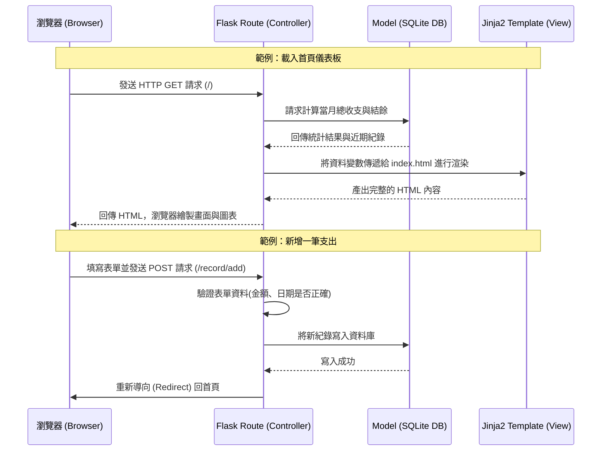

# 系統架構文件：個人記帳簿系統

本文件根據 `docs/PRD.md` 之中定義的需求，規劃出個人記帳簿系統的技術架構與資料夾結構。

## 1. 技術架構說明

### 選用技術與原因
- **後端框架：Python + Flask**
  - **原因**：Flask 是一個輕量且靈活的網頁框架，非常適合用來快速開發中小型應用程式（如個人記帳系統）。它學習曲線平緩，不會強制綁定過多不必要的組件，讓開發者能保有最大彈性。
- **模板引擎：Jinja2**
  - **原因**：Jinja2 與 Flask 完美整合，能讓我們在 HTML 檔案中直接嵌入 Python 變數與邏輯（如迴圈、條件判斷），在伺服器端將資料渲染成完整的 HTML 後再回傳給使用者，開發上簡單直覺。
- **資料庫：SQLite**
  - **原因**：個人記帳系統初期資料量不大，SQLite 是一個無伺服器、輕量級的關聯式資料庫。它將所有資料儲存在單一檔案中，無需額外安裝與設定資料庫伺服器，非常方便開發、測試與後續備份。
- **前端呈現：HTML / CSS / JavaScript**
  - **原因**：本專案不採用前後端分離架構，直接使用原生前端技術處理頁面結構與樣式，並可搭配輕量的前端函式庫（如 Chart.js）來繪製圓餅圖與折線圖，兼顧效能與開發速度。

### Flask MVC 模式說明
在本專案中，我們採用類似 MVC (Model-View-Controller) 的設計模式來分離系統職責：
- **Model (模型)**：負責與 SQLite 資料庫溝通。定義「收支紀錄」、「分類」與「預算」等資料表結構，並處理所有資料的存取、查詢、更新與刪除。
- **View (視圖)**：由 Jinja2 擔任。負責決定資料要如何呈現給使用者，將後端傳來的資料渲染到對應的 HTML 模板上（例如：儀表板畫面、新增紀錄的表單）。
- **Controller (控制器)**：由 Flask Route 擔任。負責接收來自瀏覽器的 HTTP 請求，驗證使用者輸入的表單資料，呼叫 Model 進行資料處理，最後將處理結果交給 View 來產生網頁。

## 2. 專案資料夾結構

以下是本專案建議的目錄結構，幫助團隊清楚區分不同職責的程式碼：

```text
web_app_development2/
├── app/                      ← 應用程式的主要程式碼存放區
│   ├── models/               ← 資料庫模型 (Model)
│   │   ├── __init__.py
│   │   └── database.py       ← 定義資料表 Schema 與資料庫連線邏輯
│   ├── routes/               ← Flask 路由模組 (Controller)
│   │   ├── __init__.py
│   │   ├── main.py           ← 首頁、儀表板相關路由
│   │   └── record.py         ← 收支紀錄與分類管理的 CRUD 路由
│   ├── templates/            ← Jinja2 HTML 模板檔案 (View)
│   │   ├── base.html         ← 共同的網頁排版骨架（包含導覽列）
│   │   ├── index.html        ← 首頁/儀表板（顯示餘額與圖表）
│   │   └── form.html         ← 新增/編輯收支紀錄的表單頁面
│   └── static/               ← 靜態資源檔案
│       ├── css/              
│       │   └── style.css     ← 網站自訂樣式表
│       └── js/               
│       │   └── main.js       ← 前端互動邏輯（如初始化圖表）
├── instance/                 ← 存放與環境相關的實體檔案（應加入 .gitignore）
│   └── database.db           ← SQLite 資料庫檔案
├── docs/                     ← 專案文件目錄
│   ├── PRD.md                ← 產品需求文件
│   └── ARCHITECTURE.md       ← 系統架構文件 (本文件)
├── requirements.txt          ← 專案依賴的 Python 套件清單
└── app.py                    ← 專案執行入口，負責初始化 Flask 與註冊路由
```

## 3. 元件關係圖

以下展示使用者操作時，系統各元件的資料流與互動關係：



## 4. 關鍵設計決策

1. **模組化的路由設計 (Blueprints)**
   - **原因**：為了避免所有的路由邏輯都擠在同一個 `app.py` 導致難以維護，我們會在 `app/routes/` 內使用 Flask Blueprint 將功能拆分（例如首頁功能與收支紀錄功能分開）。這樣可以提高程式碼的可讀性，擴充功能時架構也更清晰。
2. **Server-Side Rendering (伺服器端渲染) 為主**
   - **原因**：本系統核心為表單填寫與資料列表呈現，採用 Jinja2 進行全頁面的 SSR 開發速度最快且最為直接。除了「圖表分析」會依賴前端 JavaScript 繪製外，其餘邏輯皆在後端完成，降低前端的複雜度。
3. **資料存取層的隔離**
   - **原因**：將所有的 SQL 語法或資料庫存取邏輯封裝在 `app/models/` 中，讓路由層（Controller）不直接操作 SQL。這樣不僅使得 Controller 保持輕量，也便於日後維護，如果需要更換資料表結構，只需修改 Model 層即可。
4. **單一資料庫檔案 (SQLite)**
   - **原因**：考量到個人記帳系統的資料量通常不大，SQLite 的單一檔案特性讓資料備份變得極為簡單（只需備份 `instance/database.db` 檔案）。這完全符合專案「簡單、直覺」的核心目標，且免除了繁瑣的資料庫伺服器架設。
