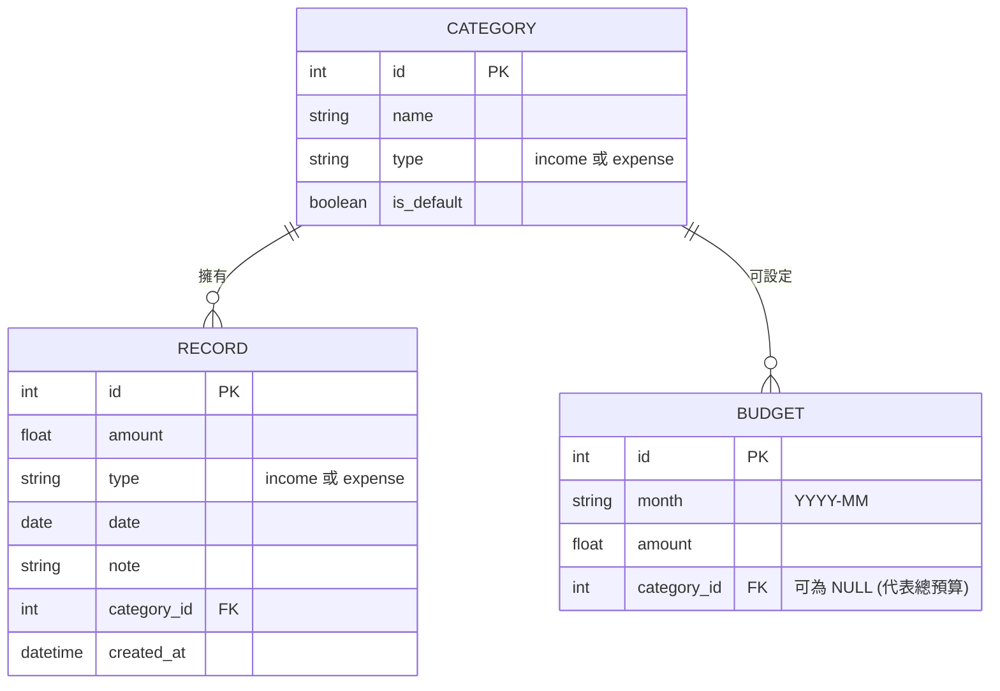

# 資料庫設計文件：個人記帳簿系統

本文件根據功能需求規劃了系統的資料庫結構（SQLite），包含 ER 圖與資料表詳細說明。

## 1. ER 圖 (實體關係圖)

## 2. 資料表詳細說明

### CATEGORY (分類表)
負責儲存收支的分類，如「飲食」、「交通」、「薪水」等。
- `id` (INTEGER): Primary Key，自動遞增。
- `name` (TEXT): 分類名稱，必填。
- `type` (TEXT): 分類屬性，限制為 'income' 或 'expense'，必填。
- `is_default` (BOOLEAN): 標記是否為系統內建分類 (1 為內建，0 為自訂)，預設為 0。

### RECORD (收支紀錄表)
負責儲存使用者的每一筆收入與支出紀錄。
- `id` (INTEGER): Primary Key，自動遞增。
- `amount` (REAL): 金額，必填。
- `type` (TEXT): 收支屬性，限制為 'income' 或 'expense'，必填。
- `date` (TEXT): 發生日期，格式為 YYYY-MM-DD，必填。
- `note` (TEXT): 備註說明，選填。
- `category_id` (INTEGER): Foreign Key，關聯至 `CATEGORY.id`。
- `created_at` (DATETIME): 建立時間戳記，預設為當前時間。

### BUDGET (預算表)
負責儲存使用者設定的預算。
- `id` (INTEGER): Primary Key，自動遞增。
- `month` (TEXT): 預算所屬月份，格式為 YYYY-MM，必填。
- `amount` (REAL): 預算金額，必填。
- `category_id` (INTEGER): Foreign Key，關聯至 `CATEGORY.id`。若為 NULL 則表示當月總預算。
