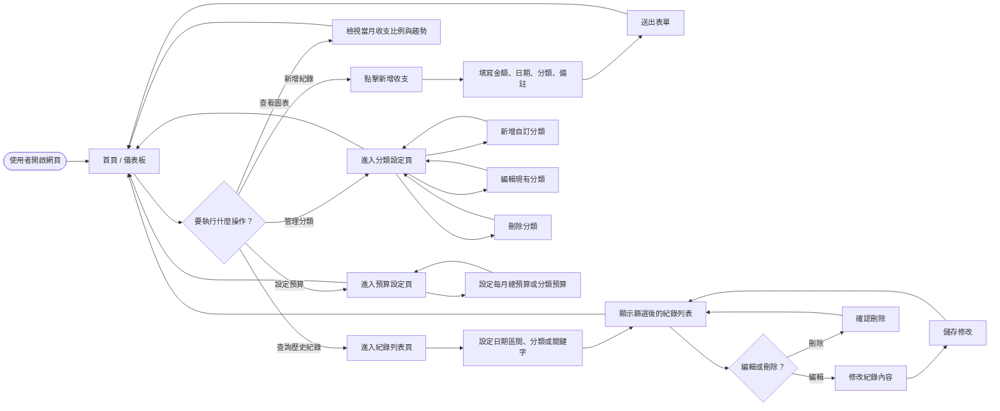
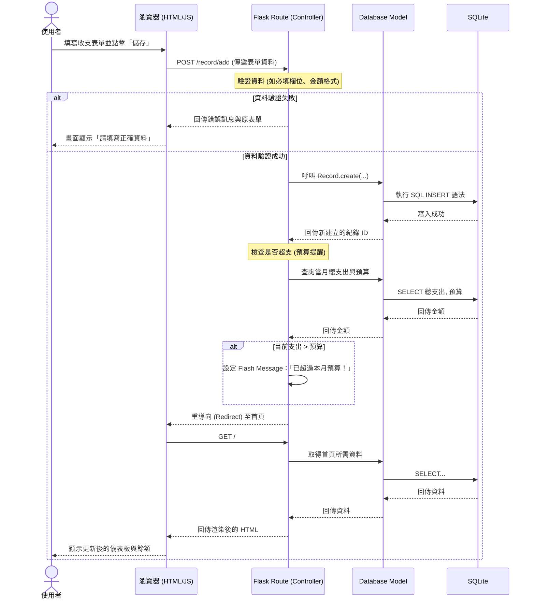

# 流程圖文件：個人記帳簿系統

本文件根據 `docs/PRD.md` 與 `docs/ARCHITECTURE.md` 規劃了個人記帳簿系統的使用者操作路徑（User Flow）與系統資料流（Sequence Diagram）。

## 1. 使用者流程圖 (User Flow)

這張圖展示了使用者進入系統後，可以進行的各種操作路徑，涵蓋了主要功能如記帳、查看圖表、管理分類與預算。

## 2. 系統序列圖 (Sequence Diagram)

這張圖描述了「使用者點擊新增一筆收支紀錄」到「資料成功存入資料庫」並返回頁面的完整流程。

## 3. 功能清單對照表

以下為 PRD 中定義的主要功能，其預估對應的 URL 路徑與 HTTP 方法：

| 功能項目 | 頁面/操作說明 | HTTP 方法 | URL 路徑預估 |
| --- | --- | --- | --- |
| **首頁與餘額統計** | 顯示儀表板、總收支、剩餘金額 | GET | `/` |
| **圖表分析** | 顯示收支圓餅圖與折線圖 (可整合於首頁) | GET | `/` 或 `/dashboard` |
| **新增紀錄** | 顯示新增表單頁面 | GET | `/record/add` |
| **儲存新紀錄** | 處理表單送出並寫入資料庫 | POST | `/record/add` |
| **查詢與篩選紀錄** | 顯示歷史紀錄列表並支援條件篩選 | GET | `/records` |
| **編輯紀錄** | 顯示編輯表單頁面 | GET | `/record/edit/<id>` |
| **儲存編輯紀錄** | 處理修改內容並更新資料庫 | POST | `/record/edit/<id>` |
| **刪除紀錄** | 刪除特定一筆紀錄 | POST | `/record/delete/<id>` |
| **分類管理列表** | 顯示內建與自訂分類 | GET | `/categories` |
| **新增/編輯分類** | 處理新增或修改分類 | POST | `/category/save` |
| **預算設定** | 顯示與修改每月預算 | GET / POST | `/budget` |
